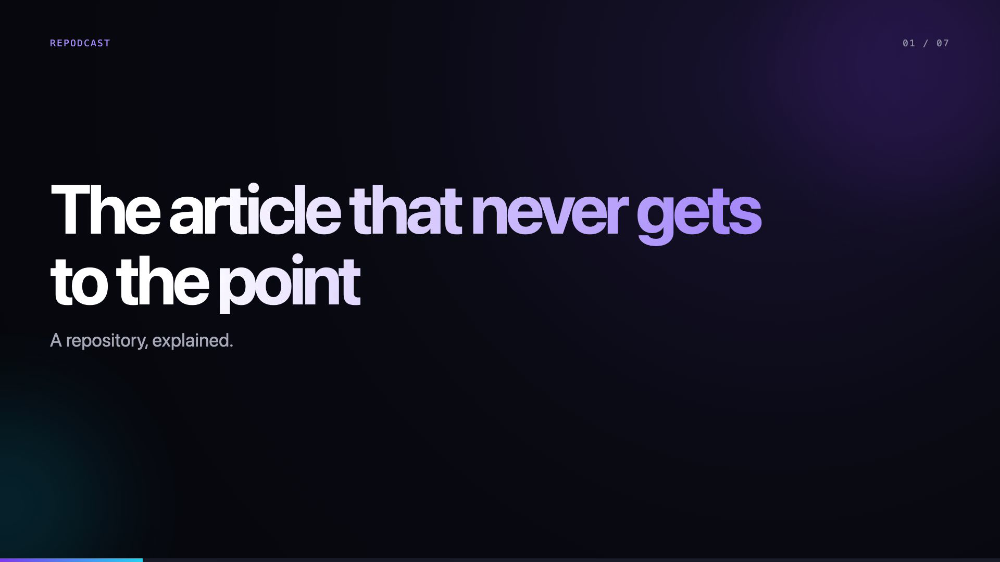
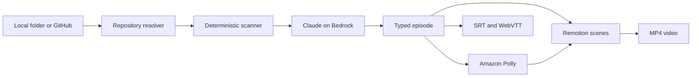
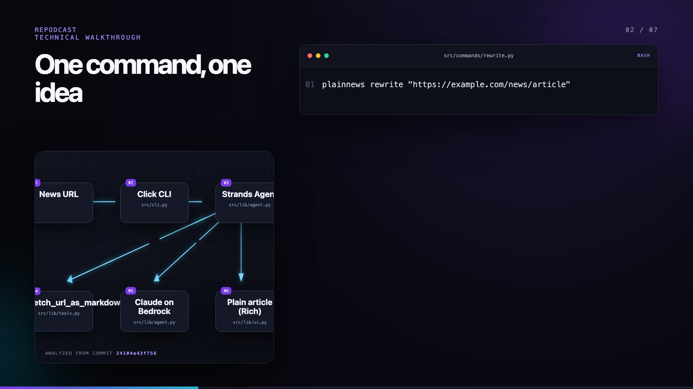
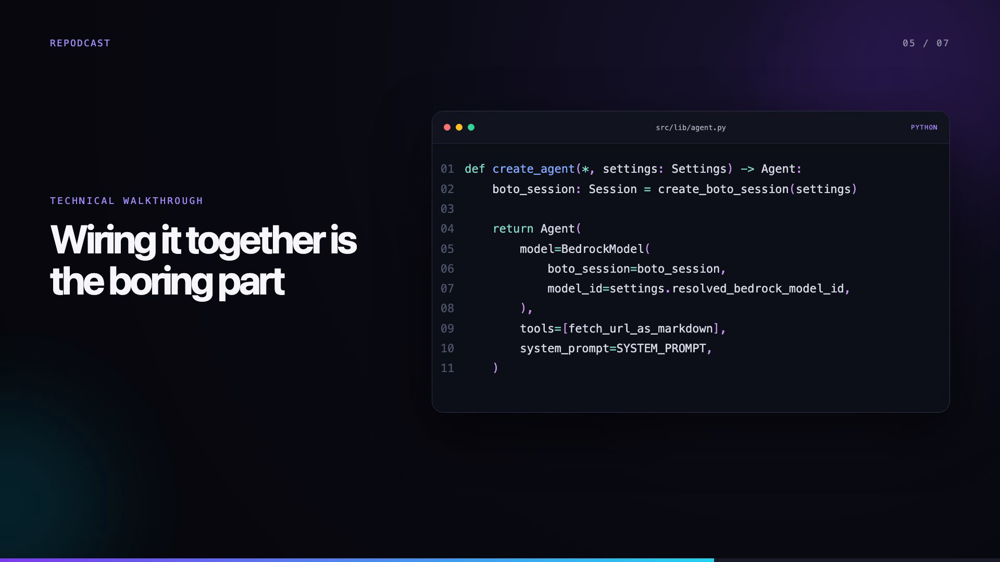

# Turning a GitHub repository into a video podcast with Python, AWS Bedrock, Polly and Remotion

I like building small proof-of-concept projects. Writing the code is usually the fun part; explaining the project afterwards is another story. Normally, I write a post like this one, but this time I wanted to try something different: a narrated video explaining the code and the project’s architecture. Something like a video podcast with two synthetic voices, accompanied by a presentation of the project.

That’s the idea.

Repodcast is a command-line application that receives a local folder or a public GitHub repository and creates a narrated technical video about it. It scans the source, asks Claude on AWS Bedrock to write the episode, generates two voices with Amazon Polly, creates subtitles and renders the final MP4 with Remotion.

This is the kind of command I wanted to run:

```bash
repodcast build gonzalo123/plainnews
```

And this is one of the generated frames:



Of course, giving a repository to an LLM and asking for a video sounds easy. The interesting part starts when we want the video to describe the real code instead of producing a generic summary with a nice gradient.

## The pipeline

The complete flow looks like this:



I deliberately split the process into stages. A single giant prompt that reads a GitHub URL and somehow returns a video would be difficult to inspect and even more difficult to test. Here each stage leaves something useful behind: `repository.json`, `episode.json`, `script.md`, one audio file per scene, SRT, WebVTT and finally the video.

If something is strange in the result, I can see where it became strange.

## First, freeze the repository

Repodcast accepts local directories, GitHub URLs and the short `owner/repository` form. Remote repositories are shallow-cloned into a local cache. I do not need the complete Git history to explain the current code, and I definitely do not want to download Git LFS objects or recurse into every submodule for a two-minute video.

The resolver keeps the exact commit SHA together with the generated episode:

```python
return ResolvedRepository(
    path=checkout.resolve(),
    display_name=repository,
    source_url=url,
    requested_ref=ref,
    commit_sha=repo.head.commit.hexsha,
)
```

That SHA is more important than it looks. Repositories change. Without it, a video can show a diagram and a code fragment that no longer exist by the time somebody watches it. Repodcast renders the analyzed commit in the architecture scene, so the explanation has a concrete source of truth.



## Less context, but better context

Sending the whole repository to Claude is not a serious strategy. Apart from cost and context limits, a repository contains a lot of material that is useless for this task: virtual environments, compiled assets, generated files, lock internals and binaries.

The scanner is deterministic Python. It applies `.gitignore`, excludes well-known generated directories, rejects large or binary files and detects the stack from manifests and extensions. Then it selects a small group of interesting files: package manifests, entry points, source files and a couple of tests.

The result is a typed `RepositorySummary`, not an unstructured dump. The model receives the tree, detected technologies, entry points and bounded excerpts. Claude does the part where an LLM is useful —finding the story in the code— while Python owns file selection and limits.

This separation also makes the scanner testable without AWS credentials. An LLM should not decide whether `node_modules` belongs in the prompt.

## Asking for an episode, not a summary

My first version of the prompt produced something technically correct and completely boring. It listed the technologies, repeated the README and finished with the usual optimistic conclusion. That is not how I explain a weekend experiment.

The current prompt asks for a small narrative arc: a concrete irritation, the idea, the execution path, one revealing implementation detail, an honest limitation and a final observation. It also asks for a conversation between a host and a guest. The guest is useful because it can ask the obvious question just before the answer needs to appear.

The response is strict JSON validated with Pydantic. A slide can contain bullets, a real code excerpt or a small architecture graph, but it always needs spoken content. Flow edges must reference existing nodes and slide indexes must be sequential.

```python
class Episode(BaseModel):
    model_config = ConfigDict(frozen=True)

    title: str = Field(min_length=1)
    target_minutes: int = Field(gt=0)
    slides: list[Slide] = Field(min_length=1)
    source_commit: str | None = None
```

LLMs do not always respect schemas, even when we ask politely. If Bedrock returns invalid JSON, Repodcast sends the validation error back once and asks Claude to repair the complete object. The second response goes through exactly the same validation. There is no `try: whatever except: continue` hidden in the pipeline.

The requested duration is also normalized in Python. The model proposes the relative duration of each scene, but code makes sure the total matches the number of minutes requested.

## Two voices and the problem with time

Each dialogue turn has a speaker identifier, `host` or `guest`. Amazon Polly maps them to different neural voices and generates one small MP3 per turn. FFmpeg concatenates the fragments with a short silence between speakers and a small tail at the end of the scene.

Originally I trusted the duration written in `episode.json`. That worked until a voice needed longer than expected and the next scene started while the last word was still playing. Now `ffprobe` measures the real audio and those durations become the timing source for Remotion and the subtitle files.

```python
slides = [
    slide.model_copy(
        update={"duration_seconds": max(1, math.ceil(_audio_duration(audio)))}
    )
    for slide, audio in zip(episode.slides, audio_files, strict=True)
]
```

It is a small detail, but it changes the pipeline from “I hope these numbers align” to “the rendered timeline follows the generated media”.

## Rendering code as code

The visual part is a React application rendered with Remotion. There are three main scene types: covers, architecture flows and code scenes. Code is highlighted with Prism and revealed line by line. Architecture nodes arrive as structured data, not as Mermaid text invented at render time, and each node can point to a real path in the repository.



The Python side copies the audio into Remotion's public directory, writes the episode props and launches the composition. React owns layout and animation; Python owns the workflow and the data contract between stages.

This boundary is useful. I can change the complete visual identity without touching repository analysis, Bedrock or Polly. I can also replace Polly with another text-to-speech provider without changing a single React component.

## Building the pipeline without spending money every time

Testing an application like this against real AI and text-to-speech services would be slow, expensive and unpredictable. Repodcast has deterministic fake adapters for both.

The fake AI produces a seven-scene episode with a flow diagram and a code example. The fake Polly adapter creates silent audio with FFmpeg. That means the same orchestration used by the real command can generate every intermediate artifact locally, including a real MP4, without calling AWS.

The tests exercise repository filtering, GitHub source resolution, prompt rules, JSON repair, SSML escaping, audio concatenation, duration measurement, subtitles and the Remotion contract. At the moment there are 19 tests. Ruff and mypy in strict mode are also part of the checks.

This does not prove that Claude will always write a good story. It proves that a strange story cannot silently break the media pipeline.

## What is still deliberately simple

Repodcast is a PoC. The scanner does not build an AST or a call graph. It chooses representative files using small heuristics, which works surprisingly well for compact repositories but will miss important relationships in a large monorepo.

Subtitles are synchronized per scene, not per word. The architecture graph is intentionally limited to six nodes because more nodes might be more accurate, but they produce a worse video. The final quality still depends on the source repository and on the model choosing the right thread to follow.

There is also an uncomfortable recursive detail: the repository may already contain a README written to explain the project. Repodcast reads that README to create another explanation of the same project, now with two synthetic voices and animated code. This is clearly over-engineered.

But it is also the kind of over-engineering I like. The result is not a presentation about a possible system. It is a working pipeline that takes a real commit, generates inspectable artifacts and ends with a video that can be watched.

The LLM writes the story. Python keeps it attached to the repository. Polly gives it voices. Remotion makes it visible.

And that's all. Full source code is available in my [GitHub](https://github.com/gonzalo123/repodcast).